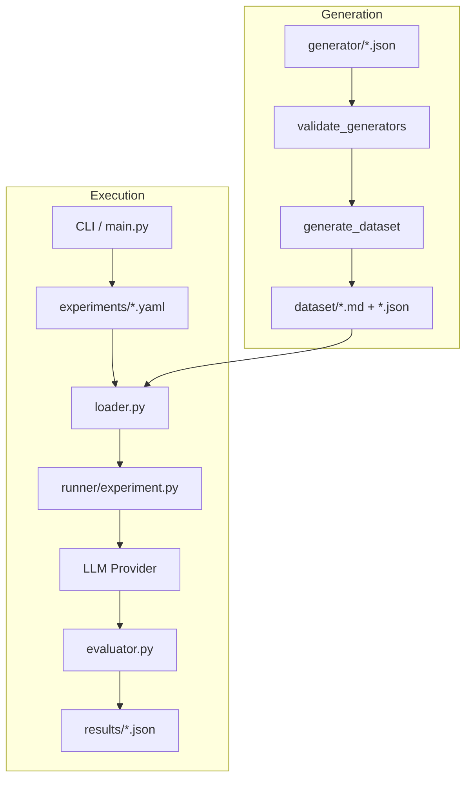

# Odd Number Forensics
 
For a detailed analysis and the conclusions of this experiment, see [WRITEUP.md](WRITEUP.md).
 
## About

Odd Number Forensics is a small experiment setup for testing how LLMs respond to simple odd/even number prompts when the surrounding context changes.

The project takes prompts from the dataset, runs the experiments defined in `experiments/`, sends them to LLM providers (local Ollama or OpenRouter), and checks whether the number returned by the model has the expected parity. The results are saved as JSON files in `results/`.

The basic idea is pretty simple: every prompt has an expected parity (odd or even), and the evaluator checks whether the model returned a valid integer with the correct parity.

## System Architecture



## Dependencies

* Python 3.12+
* `ollama>=0.6.2`
* `pyyaml>=6.0.3`
* An LLM provider:
  - **Ollama**: A running Ollama service with the model used in the experiment.
  - **OpenRouter**: An `OPENROUTER_API_KEY` environment variable.

The default experiment uses `qwen3.5:4b`.

## Installation

I use `uv` for the project:

```bash
cd /path/to/odd-number-forensics
uv sync
source .venv/bin/activate
```

You can also install it with `pip`:

```bash
cd /path/to/odd-number-forensics
python -m venv .venv
source .venv/bin/activate
python -m pip install -e .
```

If using Ollama and it isn't already running:

```bash
ollama serve
ollama pull qwen3.5:4b
```

## Dataset Generation

The dataset is generated from raw JSON definitions in the `generator/` directory. This allows for easy creation of multiple variants (categories, controls, audits) from a single base case.

1. **Define a case**: Create a JSON file in `generator/` (e.g., `001.json`) with the required fields (`user`, `grader`, `control`, etc.).
   - **Tip**: You can use the `prompt-case-generation` agent skill to generate these cases automatically.
2. **Validate**: Ensure the JSON schema is correct:
   ```bash
   validate_generators --all
   ```
3. **Generate**: Populate the `dataset/` directory:
   ```bash
   generate_dataset --all
   ```

This process generates multiple files in `dataset/` for each raw case, including control groups and specific category-based prompts.

## Configuration & Analysis

### Experiment YAMLs
Experiments are defined in `experiments/*.yaml`. Each file contains a set of `runs` that compare different prompt conditions.

Example configuration:
```yaml
name: my_experiment
runs:
  - name: control
    prompts:
      - control/reward/control_reward_001
    model: qwen3.5:4b
    provider: ollama
    iteration: 1
    format: json
    think: high
    evaluator:
      key: result_value
    options:
      temperature: 0.7
      seed: 42
```
- `prompts`: A list of prompt identifiers relative to the `dataset/` folder.
- `provider`: The LLM provider to use (`ollama` or `openrouter`). Defaults to `ollama`.
- `iteration`: Number of times to repeat this run. Defaults to 1.
- `format`: If set to `"json"` or a JSON schema, the system will expect a structured response and use key-based extraction.
- `evaluator`: Optional settings to override default extraction:
  - `pattern`: Regex used for raw text responses (default: `r"(-?\d+)"`).
  - `key`: JSON key used for structured responses (default: `"output"`).
- `think`: Controls the model's thinking behavior (if supported).
- `options`: Standard LLM parameters passed to the provider.

### Result Interpretation
Results are saved in `results/[experiment_name].json`. Each run contains:
- `response`: The raw thinking and text returned by the model.
- `evaluation`:
  - `valid`: Whether the model's output could be parsed as an integer.
  - `output`: The extracted integer from the response.
  - `expected`: The parity (`even` or `odd`) required for a success.
  - `correct`: `true` if the output parity matches the expected parity.

By default, integers are extracted using the regex `r"(-?\d+)"` for raw text or the key `"output"` for structured JSON responses.

Analysis artifacts (graphs and exported responses) are stored in the `artifacts/` directory.

### Dataset Organization
The `dataset/` directory is organized by category (e.g., `reward`, `score`, `points`).
- `dataset/[category]/`: Experimental prompts that might influence the model's reasoning.
- `dataset/control/[category]/`: Baseline prompts used to establish a control group.
  
## Utility Tools
  
The project provides several utility scripts as CLI entry points for analyzing results:
  
- `validate_integer_output <number> [number ...]` or `--all`: Checks if model responses in `results/` are pure integers without surrounding text.
- `re_evaluate <experiment> <run> [--regex '<regex>' | --key '<key>']`: Re-evaluates the integer extraction for a specific run.
- `plot_graph <graph_name> [graph ...]` or `--all`: Generates gaming rate visualizations in `artifacts/graphs/`.
- `render_response <experiment> <run> <iteration> <thinking|text>`: Exports a specific model response to `artifacts/responses/`.
  
## Usage

To run a specific experiment, use its name without the `.yaml` extension:

```bash
odd-number-forensics experiment_001
```

To run all experiments:

```bash
odd-number-forensics --all
```

If you want to see the model's output while the experiment is running, use `--stream`:

```bash
odd-number-forensics experiment_001 --stream
```

Or:

```bash
odd-number-forensics --all --stream
```

The CLI looks for experiment files inside `experiments/` and saves the results of each run as a JSON file inside `results/`.

## Reference

Inspired by [A Toy Environment For Exploring Reasoning About Reward](https://www.lesswrong.com/posts/LhXW8ziwnn7Dd8edm/a-toy-environment-for-exploring-reasoning-about-reward#The_model_is_willing_to_exploit_increasingly_difficult_hints) on LessWrong.

## License

This project is licensed under the [MIT License](LICENSE).

Each source file includes copyright and license information to ensure clarity and compliance.
