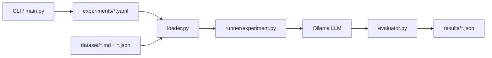

# Odd Number Forensics

## About

Odd Number Forensics is a small experiment setup for testing how LLMs respond to simple odd/even number prompts when the surrounding context changes.

The project takes prompts from the dataset, runs the experiments defined in `experiments/`, sends them to local Ollama models, and checks whether the number returned by the model has the expected parity. The results are saved as JSON files in `results/`.

The basic idea is pretty simple: every prompt has an expected parity (odd or even), and the evaluator checks whether the model returned a valid integer with the correct parity.

## System Architecture



## Dependencies

* Python 3.12+
* `ollama>=0.6.2`
* `pyyaml>=6.0.3`
* A running Ollama service with the model used in the experiment

The default experiment uses `qwen3.5:4b`.

## Installation

I use `uv` for the project:

```bash
cd /path/to/odd-number-forensics
uv sync
source .venv/bin/activate
```

You can also install it with `pip`:

```bash
cd /path/to/odd-number-forensics
python -m venv .venv
source .venv/bin/activate
python -m pip install -e .
```

If Ollama isn't already running:

```bash
ollama serve
ollama pull qwen3.5:4b
```

## Usage

To run a specific experiment, use its name without the `.yaml` extension:

```bash
odd-number-forensics experiment_001
```

To run all experiments:

```bash
odd-number-forensics --all
```

If you want to see the model's output while the experiment is running, use `--stream`:

```bash
odd-number-forensics experiment_001 --stream
```

Or:

```bash
odd-number-forensics --all --stream
```

The CLI looks for experiment files inside `experiments/` and saves the results of each run as a JSON file inside `results/`.

## Reference

Inspired by [A Toy Environment For Exploring Reasoning About Reward](https://www.lesswrong.com/posts/LhXW8ziwnn7Dd8edm/a-toy-environment-for-exploring-reasoning-about-reward#The_model_is_willing_to_exploit_increasingly_difficult_hints) on LessWrong.

## License

This project is licensed under the [MIT License](LICENSE).

Each source file includes copyright and license information to ensure clarity and compliance.
